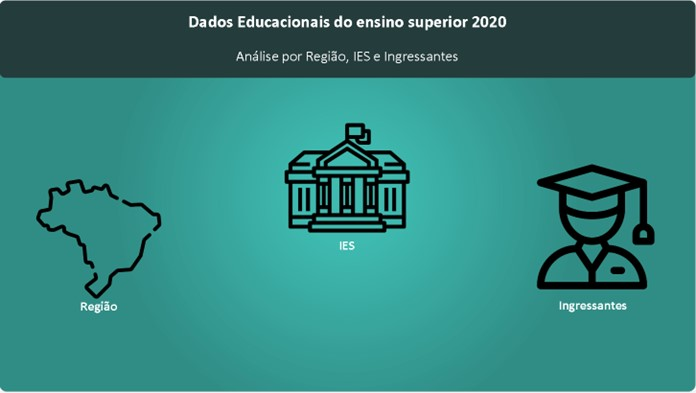
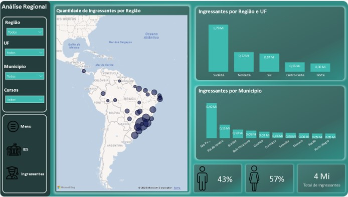
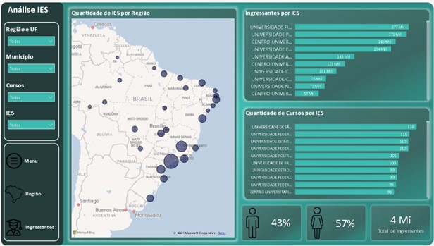
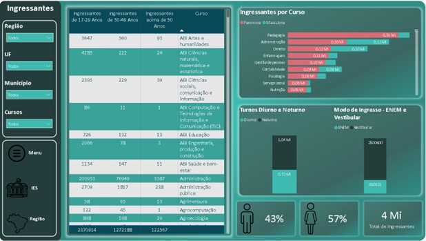

# Data Analytics Project: Higher Education in Brazil in 2020

This project, developed as part of the Data Analytics course, aims to analyze the landscape of public higher education in Brazil in 2020. Using data from the National Institute of Educational Studies and Research Anísio Teixeira (Inep), the project encompasses multiple stages, from data collection and preparation to modeling and interactive visualization.

Initial data cleaning and preparation were performed using Microsoft Excel to ensure data consistency and standardization. An Entity-Relationship Diagram (ERD) was created to structure the database and define relationships, facilitating analytical modeling and preserving data integrity.

The final stage involved creating interactive visualizations in Power BI, leveraging DAX calculations and measures to build dynamic dashboards. These visualizations showcase key indicators, such as the profile and distribution of new students by region, age, and gender, as well as the number of institutions and courses available across regions.

This project offers in-depth insights into undergraduate course preferences and an overview of Brazil's public higher education sector, providing a clear and accessible analysis of the educational landscape in 2020.
## Dashboard Overview

Explore the interactive Power BI dashboard, which provides comprehensive insights into public higher education in Brazil for 2020. The dashboard features four main tabs, each focusing on different aspects of the data, allowing for detailed and customized analysis.

### [View the Dashboard](https://app.powerbi.com/view?r=eyJrIjoiOTcxMjBmN2YtZWFhNS00YzA4LWE2NzEtNzRmZGQ3OWY5ZmE5IiwidCI6IjJkM2IxMDY0LTc1MDEtNDQ0NC04MzRlLTI2YmI2NjNkMzhmZSJ9&pageName=ReportSectione93835085c205b6e0c94)  
*(https://app.powerbi.com/view?r=eyJrIjoiOTcxMjBmN2YtZWFhNS00YzA4LWE2NzEtNzRmZGQ3OWY5ZmE5IiwidCI6IjJkM2IxMDY0LTc1MDEtNDQ0NC04MzRlLTI2YmI2NjNkMzhmZSJ9&pageName=ReportSectione93835085c205b6e0c94)*

1. **Menu**  
   The first tab presents the main menu, where users can select their area of interest: **Region**, **Higher Education Institutions (IES)**, or **Freshmen**. This menu offers intuitive navigation to quickly access relevant information based on the user’s focus.

   

2. **Region**  
   This tab features three main visualizations: a map displaying the distribution of freshmen by region, a chart showing the number of freshmen by region and state, and a graph highlighting the top 10 municipalities with the most freshmen. Additional information on the gender distribution (percentage of female and male entrants) and the total number of entrants is provided. Filters for **Region**, **State**, **Municipality**, and **Courses** allow users to tailor the data view.  
   

3. **IES (Higher Education Institutions)**  
   The third tab focuses on educational institutions, showcasing a map of the number of institutions by region, a graph of institutions with the highest number of entrants, and a chart showing the variety of courses each institution offers. Gender distribution and total entrant data are also included. Users can filter by **Region**, **State**, **Municipality**, **Courses**, and **HEIs** for customized data analysis.  
   

4. **Freshmen**  
   The final tab provides detailed insights into the entrants, including: a chart of freshmen per course (with gender breakdown), a comparison of entry modes (ENEM vs. traditional entrance exam), and a chart of entrant shifts (day vs. night). A table displays the number of entrants by age group for each course. Users can filter data by **Region**, **State**, **Municipality**, and **Courses** for in-depth analysis.  
   

## Tools Used

This project utilizes several tools for data preparation, modeling, and visualization:

- **Microsoft Excel**: Used for data cleaning, standardization, and preparation.
- **Power BI**: Used for creating interactive dashboards and visualizations.
- **DAX (Data Analysis Expressions)**: Used in Power BI to create calculated measures and columns that help summarize and analyze the data effectively.

## References

 - **Data Source**:
https://www.gov.br/inep/pt-br/acesso-a-informacao/dados-abertos/microdados/censo-da-educacao-superior

- **Prepared Data Files**: See the `data` folder in this repository for preprocessed Excel files used in this project:
https://github.com/Gustavo-Saffiotti/Data_Analytics/tree/main/Dataset_Education

